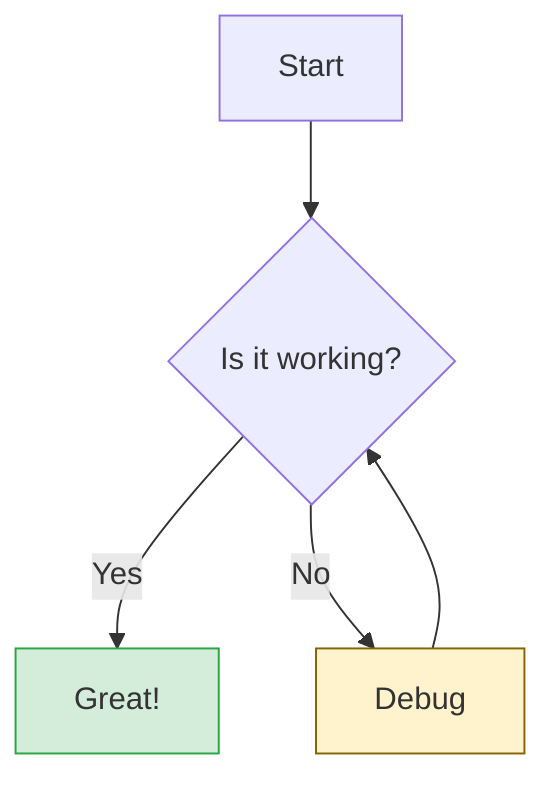
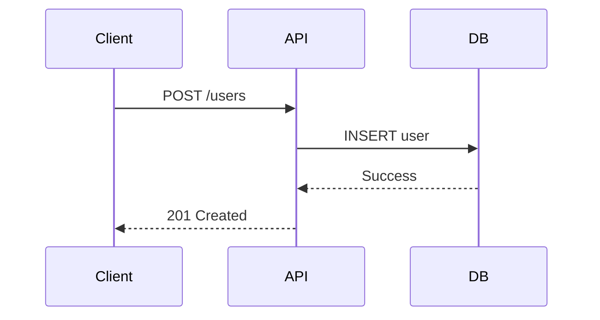

# Beautiful Charts & Diagrams

Skills for rendering beautiful, publication-quality chart and diagram images (transparent PNG). **Bun + Chart.js** for charts, **Mermaid.js** for diagrams. No Python or system dependencies required.

## Installation

```bash
npx skills add kwanLeeFrmVi/beautiful-charts --skill beautiful-charts
```

```bash
npx skills add kwanLeeFrmVi/beautiful-charts --skill beautiful-mermaid-diagrams
```

## Features

### Beautiful Charts

- **Multiple chart types**: Line, bar, horizontal bar, area, scatter, and donut charts
- **Transparent PNG output**: Editorial styling with a clean design system
- **Zero system deps**: Uses `@napi-rs/canvas` (pre-built binaries) — no Cairo/Python needed
- **One-liner run**: `bunx -y` downloads and executes on demand

### Beautiful Mermaid Diagrams

- **Multiple diagram types**: Flowcharts, sequence diagrams, class diagrams, state diagrams, ER diagrams, Gantt charts, pie charts, git graphs, mindmaps
- **Transparent PNG output**: Clean diagrams with transparent backgrounds
- **Theme support**: `default`, `forest`, `dark`, `neutral` themes
- **Custom styling**: `classDef` for node colors and styles
- **High resolution**: Scale factor support for crisp output

## Prerequisites

Install **Bun** (one-time setup):

```bash
# macOS / Linux
curl -fsSL https://bun.sh/install | bash

# Windows
powershell -c "irm bun.sh/install.ps1|iex"
```

## Usage

### Quick Start

1. Create a chart configuration JSON file
2. Run the renderer with `bunx`
3. View the generated PNG

```bash
bunx -y beautiful-chartsjs chart_config.json output.png
```

### Chart Types

| Chart Type  | Use Case                  | Config Type |
| ----------- | ------------------------- | ----------- |
| `line`      | Trend over time           | `line`      |
| `bar`       | Period comparisons        | `bar`       |
| `hbar`      | Rankings / long labels    | `hbar`      |
| `area`      | Filled trend              | `area`      |
| `scatter`   | Correlation / bubbles     | `scatter`   |
| `donut`     | Part-of-whole (with hole) | `donut`     |
| `pie`       | Part-of-whole (solid)     | `pie`       |
| `polarArea` | Circular comparison       | `polarArea` |
| `radar`     | Multivariate comparison   | `radar`     |

### Configuration Format

```json
{
  "type": "line",
  "title": "Chart Title",
  "subtitle": "Unit · note",
  "source": "Source: XYZ",
  "labels": ["A", "B", "C"],
  "yMin": 0,
  "yMax": 100,
  "yPrefix": "$",
  "ySuffix": "M",
  "width": 900,
  "height": 480,
  "datasets": [
    {
      "label": "Series 1",
      "color": "blue",
      "data": [10, 20, 30]
    }
  ]
}
```

### Color Palette

Use these color names (not hex codes):

| Name     | Hex       | Use Case        |
| -------- | --------- | --------------- |
| `blue`   | `#185FA5` | 1st / primary   |
| `red`    | `#E24B4A` | 2nd / negative  |
| `teal`   | `#1D9E75` | 3rd / positive  |
| `amber`  | `#BA7517` | 4th / warning   |
| `purple` | `#534AB7` | 5th             |
| `gray`   | `#888780` | neutral / other |

### Examples

#### Line Chart - Oil Prices

```json
{
  "type": "line",
  "title": "Crude oil prices",
  "subtitle": "$/barrel",
  "labels": ["Mar 21", "Mar 23", "Mar 24", "Mar 25"],
  "yMin": 80,
  "yMax": 120,
  "yPrefix": "$",
  "datasets": [
    {
      "label": "WTI",
      "color": "blue",
      "fill": true,
      "data": [112.0, 88.13, 91.61, 90.98]
    },
    {
      "label": "Brent",
      "color": "red",
      "fill": false,
      "data": [112.0, 99.94, 103.0, 101.5]
    }
  ]
}
```

#### Bar Chart - Revenue

```json
{
  "type": "bar",
  "title": "Quarterly revenue",
  "subtitle": "USD millions",
  "labels": ["Q1", "Q2", "Q3", "Q4"],
  "yMin": 0,
  "yMax": 30,
  "yPrefix": "$",
  "ySuffix": "M",
  "datasets": [
    { "label": "2025", "color": "blue", "data": [12.4, 18.7, 15.2, 22.1] },
    { "label": "2026", "color": "teal", "data": [14.1, 20.3, 17.8, 25.6] }
  ]
}
```

#### Donut Chart - Market Share

```json
{
  "type": "donut",
  "title": "Browser share 2026",
  "datasets": [
    {
      "labels": ["Chrome", "Safari", "Firefox", "Edge", "Other"],
      "colors": ["blue", "red", "amber", "teal", "gray"],
      "data": [65, 18, 7, 5, 5]
    }
  ]
}
```

## Mermaid Diagrams Usage

### Quick Start

1. Create a `.mmd` file with Mermaid syntax
2. Render to PNG with `bunx`
3. View the generated diagram

```bash
bunx -y @mermaid-js/mermaid-cli -i diagram.mmd -o output.png -b transparent -s 2
```

### Diagram Types

| Purpose                 | Type             | Syntax prefix     |
| ----------------------- | ---------------- | ----------------- |
| Process / decision flow | Flowchart        | `graph TD`        |
| Interactions over time  | Sequence diagram | `sequenceDiagram` |
| Object relationships    | Class diagram    | `classDiagram`    |
| States and transitions  | State diagram    | `stateDiagram-v2` |
| Database schema         | ER diagram       | `erDiagram`       |
| Project timeline        | Gantt chart      | `gantt`           |
| Circular processes      | Pie chart        | `pie`             |
| Git branching           | Git graph        | `gitGraph`        |
| Mind mapping            | Mindmap          | `mindmap`         |

### CLI Options

| Option                  | Description                                   | Recommended        |
| ----------------------- | --------------------------------------------- | ------------------ |
| `-t, --theme <theme>`   | Theme: `default`, `forest`, `dark`, `neutral` | `forest` or `dark` |
| `-b, --backgroundColor` | Background color                              | `transparent`      |
| `-s, --scale <scale>`   | Scale factor for resolution                   | `2` or higher      |
| `-w, --width <width>`   | Canvas width                                  | As needed          |
| `-H, --height <height>` | Canvas height                                 | As needed          |

### Examples

#### Flowchart



**Render:**

```bash
bunx -y @mermaid-js/mermaid-cli -i flowchart.mmd -o diagram.png -b transparent -t forest -s 2
```

#### Sequence Diagram



**Render:**

```bash
bunx -y @mermaid-js/mermaid-cli -i sequence.mmd -o diagram.png -b transparent -t dark -s 2
```

#### Class Diagram

```mermaid
classDiagram
    class User {
        +String name;
        +String email;
        +login();
    }
    class Post {
        +String title;
        +String content;
        +publish();
    }
    User "1" --> "*" Post : writes;
```

**Render:**

```bash
bunx -y @mermaid-js/mermaid-cli -i class.mmd -o diagram.png -b transparent -t forest -s 2
```

## Sizing Guide

| Use Case                | Dimensions         |
| ----------------------- | ------------------ |
| Default                 | 900 × 480          |
| Wide panel              | 1200 × 400         |
| Square / social         | 800 × 800          |
| Horizontal bar (N rows) | 900 × (N×48 + 100) |
| Thumbnail               | 600 × 320          |

## Schema Reference

- See `skills/beautiful-charts/schemas.md` for detailed dataset schemas for each chart type.
- See `skills/beautiful-mermaid-diagrams/SKILL.md` for Mermaid diagram syntax and examples.

## How It Works

### Beautiful Charts

The renderer (`render_chart.js`) uses:

- **[Bun](https://bun.sh)** — JS runtime with native TypeScript/ESM support
- **[Chart.js 4](https://www.chartjs.org)** — chart rendering
- **[@napi-rs/canvas](https://github.com/Brooooooklyn/canvas)** — server-side Canvas API with pre-built binaries (no Cairo)

### Beautiful Mermaid Diagrams

The renderer uses:

- **[@mermaid-js/mermaid-cli](https://github.com/mermaid-js/mermaid-cli)** — Mermaid.js CLI for server-side diagram rendering
- **Puppeteer** — Headless browser for PNG generation

## Triggers

### Beautiful Charts

This skill is automatically triggered when users ask to:

- Draw, plot, chart, or graph data
- Visualize numbers or tables
- Create bar charts, line graphs, pie/donut charts, scatter plots
- Convert CSV or spreadsheet data to visual charts

### Beautiful Mermaid Diagrams

This skill is automatically triggered when users ask to:

- Create flowcharts, sequence diagrams, class diagrams
- Draw ER diagrams, state diagrams, Gantt charts
- Make mindmaps or git graphs
- Visualize processes, architectures, or relationships

## License

MIT
