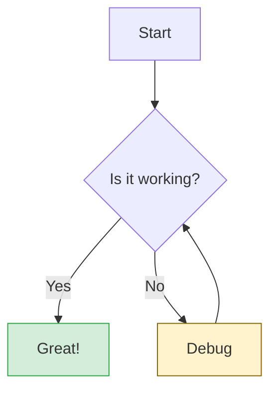
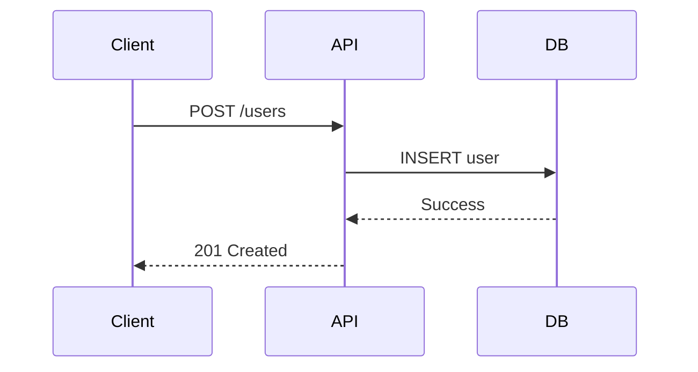

# Styled Mermaid Diagrams → PNG

Renders transparent-background PNG diagrams directly using `@mermaid-js/mermaid-cli` with theme support and custom styling.

## Pipeline

```
Write diagram.mmd  →  bunx -y @mermaid-js/mermaid-cli -i diagram.mmd -o ~/diagram.png -b transparent -s 2  →  exportFile + 
```

> **Display rule:** After rendering to `~/diagram.png` (cross-platform path):
>
> 1. Call `exportFile` tool on `~/diagram.png` to get a public URL
> 2. Display the image using `` — renders inline in chat
>
> `present_files` alone shows a download button with no preview — always use `exportFile` + `` first.

---

## Step 1 — Pick diagram type

| Purpose                 | Type             | Syntax prefix     |
| ----------------------- | ---------------- | ----------------- |
| Process / decision flow | Flowchart        | `graph TD`        |
| Interactions over time  | Sequence diagram | `sequenceDiagram` |
| Object relationships    | Class diagram    | `classDiagram`    |
| States and transitions  | State diagram    | `stateDiagram-v2` |
| Database schema         | ER diagram       | `erDiagram`       |
| Project timeline        | Gantt chart      | `gantt`           |
| Circular processes      | Pie chart        | `pie`             |
| Git branching           | Git graph        | `gitGraph`        |
| Mind mapping            | Mindmap          | `mindmap`         |

---

## Step 2 — Write diagram.mmd

Create a file named `diagram.mmd` with the Mermaid syntax.



---

## Step 3 — Run & display

Use `bunx -y @mermaid-js/mermaid-cli` (or `mmdc`) to render the diagram.

**Common CLI Options:**

- `-t, --theme <theme>`: Theme (`default`, `forest`, `dark`, `neutral`)
- `-b, --backgroundColor <color>`: Background color (use `transparent` for best results)
- `-s, --scale <scale>`: Scale factor (use `2` or higher for better resolution)
- `-w, --width <width>`: Canvas width
- `-H, --height <height>`: Canvas height

```bash
# Render with transparent background, forest theme, and 2x scale
# Output to ~/diagram.png (cross-platform home directory)
bunx -y @mermaid-js/mermaid-cli -i diagram.mmd -o ~/diagram.png -b transparent -t forest -s 2
```

**Show inline in chat (REQUIRED):**

1. Export to get a public display URL: `exportFile("~/diagram.png")`
2. Use the returned URL: ``

**Optional download:**

```bash
cp ~/diagram.png ./outputs/diagram.png
# → call present_files ["./outputs/diagram.png"]
```

---

## Quick examples

### Sequence diagram — API flow

Write to `api_flow.mmd`:



Render (Dark Theme):

```bash
bunx -y @mermaid-js/mermaid-cli -i api_flow.mmd -o ./diagram.png -b transparent -t dark -s 2
```

### Class diagram — data model

Write to `data_model.mmd`:

```mermaid
classDiagram;
    class User {
        +String name;
        +String email;
        +login();
    }
    class Post {
        +String title;
        +String content;
        +publish();
    }
    User "1" --> "*" Post : writes;
```

Render (Forest Theme):

```bash
bunx -y @mermaid-js/mermaid-cli -i data_model.mmd -o ./diagram.png -b transparent -t forest -s 2
```

---

## Checklist

- [ ] `diagram.mmd` contains valid Mermaid syntax
- [ ] Render command uses `-b transparent` and `-s 2` for high quality
- [ ] Output to `~/diagram.png` (cross-platform home directory)
- [ ] `exportFile` called after render → display with ``
- [ ] `classDef` used for custom styling when needed

## Common mistakes

| Wrong                          | Right                                       |
| ------------------------------ | ------------------------------------------- |
| Only `present_files`           | Call `exportFile` first, then `` |
| Invalid Mermaid syntax         | Validate syntax first                       |
| Missing semicolons in syntax   | End each statement with `;`                 |
| Blurry output                  | Add `-s 2` or `-s 3` to the command         |
| White background covering text | Add `-b transparent` to the command         |
